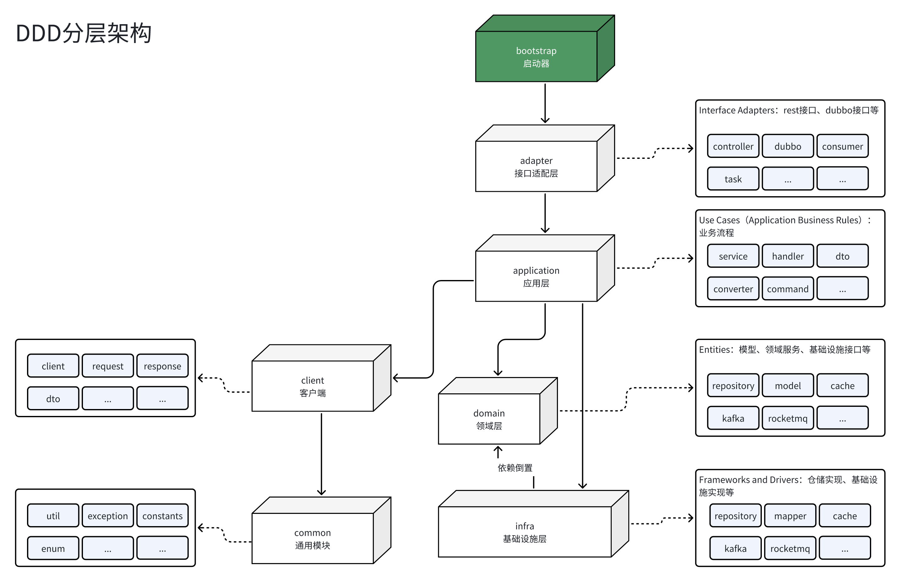

* [架构风格](#架构风格)
* [DEMO](#demo)
* [使用方式](#使用方式)
   * [方式1、如果你的应用没有使用springboot](#方式1如果你的应用没有使用springboot)
   * [方式2、如果你的应用使用springboot](#方式2如果你的应用使用springboot)
* [重要组件介绍](#重要组件介绍)
   * [Command（命令）](#command命令)
   * [Event（事件）](#event事件)
   * [CommandBus（命令总线）](#commandbus命令总线)
   * [EventBus（事件总线）](#eventbus事件总线)
   * [CommandHandler（命令处理器）](#commandhandler命令处理器)
   * [CommandInterceptor（命令拦截器）](#commandinterceptor命令拦截器)
   * [CommandValidator（命令验证器）](#commandvalidator命令验证器)
   * [Assembler（组装器）](#assembler组装器)
   * [Converter（转换器）](#converter转换器)
   * [ConcurrencyConflicts（并发校验工具）](#concurrencyconflicts并发校验工具)
* [参考](#参考)

### 架构风格
结合了<a href="https://blog.cleancoder.com/uncle-bob/2012/08/13/the-clean-architecture.html" target="_blank">整洁架构风格</a> 、CQRS风格以及分层架构风格，并采用依赖原则分4层，如下：
* adapter 接口适配层（适配dubbo、restful接口等协议）
* application 应用层（实现用例的地方，eg：电商场景里的用户下单、商家发布商品等等）
* domain 领域层（写领域逻辑的地方，eg：电商场景里的用户下单包含订单逻辑、商品逻辑、以及优惠逻辑等）
* infrastructure 基础层（放Cache、MQ框架、数据库持久实现等的地方）

模块依赖关系以及与<a href="https://blog.cleancoder.com/uncle-bob/2012/08/13/the-clean-architecture.html" target="_blank">整洁架构风格</a>模块对应关系：


各模块详细拆解：


### DEMO
* 执行ddd-module-demo/ddd-bootstrap下的App类的main方法
* 创建一个商品
```
curl -H "Content-Type:application/json" -X POST http://localhost:8080/product/create --data '{"name":"test","description":"test description"}'
```
代码路径：ProductController.createProduct

* 获取商品信息(<a href="http://localhost:8080/product/get?productId=1" target="_blank">点击</a>)
```
http://localhost:8080/product/get?productId=1
```
代码路径：ProductController.getProduct

* 获取商品信息(命令行)
```
curl -H "Content-Type:application/json"  -X GET 'http://localhost:8080/product/get?productId=1'
```
代码路径：ProductController.getProduct

* 分页查询商品信息(<a href="http://localhost:8080/product/query?name=test" target="_blank">点击</a>)

代码路径：ProductController.queryProducts

* 修改商品
```
curl -H "Content-Type:application/json" -X POST http://localhost:8080/product/update --data '{"productId":"1","name":"test","description":"test description"}'
```
代码路径：ProductController.updateProduct

* 禁用商品
```
curl -H "Content-Type:application/json" -X POST 'http://localhost:8080/product/deactivate?productId=1'
```
代码路径：ProductController.deactivateProduct

* 启用商品
```
curl -H "Content-Type:application/json" -X POST 'http://localhost:8080/product/activate?productId=1'
```
代码路径：ProductController.activateProduct

* 删除商品
```
curl -H "Content-Type:application/json" -X POST 'http://localhost:8080/product/delete?productId=1'
```
代码路径：ProductController.deleteProduct

### 使用方式

注意：需要提前将jar ```mvn clean install -Dmaven.test.skip=true```进maven本地库或私库里

* ##### 方式1、如果你的应用「没有使用」SpringBoot
```
<dependency>
    <groupId>com.runssnail.ddd</groupId>
    <artifactId>ddd-spring</artifactId>
    <version>${ddd.version}</version>
</dependency>
```

增加spring配置，加入配置后，默认自动从spring上下文收集CommandHandler和EventHandler（需要在类上增加spring注解@Service、@Component等）
```
<bean id="commandBus" class="com.runssnail.ddd.spring.CommandBusFactoryBean"/>
<bean id="eventBus" class="com.runssnail.ddd.spring.EventBusFactoryBean"/>
    
```


* ##### 方式2、如果你的应用「使用」了SpringBoot
```
<dependency>
    <groupId>com.runssnail.ddd</groupId>
    <artifactId>ddd-spring-boot-starter</artifactId>
    <version>${ddd.version}</version>
</dependency>
```

### 重要组件介绍

* ##### Command（命令）
一个Command对象对应一个用例的请求数据
```
@Data
public class CreateProductCommand extends AbstractCommand<Result> {

    private String name;

    private String description;

    @Override
    public Class<Result> resultType() {
        return Result.class;
    }
}

```

* ##### Event（事件）
表示一个领域事件，用例完成后，发布一个领域事件

```
@Getter
public class ProductCreatedEvent extends AbstractEvent {

    private String productId;

    public ProductCreatedEvent(String productId) {
        this.productId = productId;
    }
}
```

* ##### CommandBus（命令总线）
分发Command到对应的CommandHandler里去处理业务


```
@Component
public class ProductApplicationService {

    @Autowired
    private CommandBus commandBus;

    /**
     * 创建商品
     *
     * @param command
     * @return
     */
    @Transactional
    public Result<Product> createProduct(CreateProductCommand command) {
        return commandBus.dispatch(command);
    }
}

```

* ##### EventBus（事件总线）
用来发布领域事件


```
  @Component
  public class CreateProductCommandHandler extends BaseCommandHandler<CreateProductCommand, Result> {
  
      // 这里省略...

      @Autowired
      private EventBus eventBus;
  
      @Override
      public Class<CreateProductCommand> supportCommand() {
          return CreateProductCommand.class;
      }
  
      @Override
      public Result<String> doHandle(CreateProductCommand command) {
  
          // 转换领域对象
          Product product = this.productDomainService.createProduct(command);
  
          // 保存数据
          productRepository.save(product);
  
          // 发布领域事件
          eventBus.publish(new ProductCreatedEvent(product.getProductId()));
  
          return Result.success(product.getProductId());
      }
  }

```

* ##### CommandHandler（命令处理器）
用来实现用例，一个Command对应一个CommandHandler

```
  @Component
    public class CreateProductCommandHandler extends BaseCommandHandler<CreateProductCommand, Result> {
    
        // 这里省略...
    
        @Override
        public Class<CreateProductCommand> supportCommand() {
            return CreateProductCommand.class;
        }
    
        @Override
        public Result<String> doHandle(CreateProductCommand command) {
    
            // do bussniess
         
            return Result.success(product.getProductId());
        }
    }
```
* ##### CommandInterceptor（命令拦截器）
用来拦截Command，支持多个CommandInterceptor处理同一个Command
```
@Component
@Order(1)
public class CreateProductInterceptor implements CommandInterceptor<CreateProductCommand, Result> {

    private static final Logger log = LoggerFactory.getLogger(CreateProductInterceptor.class);

    @Override
    public Class<CreateProductCommand> supportCommandType() {
        return CreateProductCommand.class;
    }

    @Override
    public void beforeHandle(CreateProductCommand command) {
        log.info("CreateProductInterceptor.preHandle");
    }

    @Override
    public void afterHandle(CreateProductCommand command, Result result) {
        log.info("CreateProductInterceptor.postHandle");
    }
}

```
* ##### CommandValidator（命令验证器）
用来验证Command参数完整性或者业务前置校验，默认支持Hibernate Validator
```
@Component
public class CreateProductCommandValidator implements CommandValidator<CreateProductCommand> {

    @Override
    public Class<CreateProductCommand> supportType() {
        return CreateProductCommand.class;
    }

    @Override
    public void validate(CreateProductCommand createProductCommand) throws IllegalArgumentException, BizException {
        Validate.notNull(createProductCommand);
        Validate.notNull(createProductCommand.getName());
        Validate.isTrue(createProductCommand.getName().length() <= 10);
    }
}
```
* ##### Assembler（组装器）
用来组装查询请求数据，将领域实体对象转换成DTO后返回给外部使用，将领域对象封装在内部
```
@Component
public class CreateProductAssembler implements Assembler<Product, ProductDTO> {

    @Override
    public ProductDTO assemble(Product product) {

        ProductDTO target = new ProductDTO();
        BeanUtils.copyProperties(product, target);
        return target;
    }
}

```

* ##### Converter（转换器）
实现领域实体对象和数据对象之间的转换
```
@Component
public class ProductConverter implements Converter<Product, ProductDO> {

    @Override
    public ProductDO serialize(Product product) {

        // todo 领域对象转换成数据对象
        ProductDO productDO = new ProductDO();
        productDO.setId(product.getProductId());
        return productDO;
    }

    @Override
    public Product deserialize(ProductDO productDO) {

        // todo 数据对象转换成领域对象
        return new Product(productDO.getId());
    }
}

```


* ##### ConcurrencyConflicts（并发校验工具）
用来判断修改数据时，是否产生了并发问题。
```
 @Override
    public void remove(Product product) throws ConcurrencyConflictException {
        
        // 方式1:
        int count = this.productDOMapper.deleteById(product.getId(), product.getOperator(), product.getConcurrencyVersion());
        ConcurrencyConflicts.check(count, "remove Product, id={}, concurrencyVersion={}", product.getId(), product.getConcurrencyVersion());
    
        // 方式2:
        ConcurrencyConflicts.check(() -> productMapper.removeProduct(product.getProductId(), product.getOperator(), product.getConcurrencyVersion()));
    }
    }
```


### 参考
* <a href="https://blog.cleancoder.com/uncle-bob/2012/08/13/the-clean-architecture.html" target="_blank">整洁架构</a>
* <a href="https://github.com/alibaba/COLA" target="_blank">Alibaba COLA</a>
* <a href="https://github.com/AxonFramework/AxonFramework" target="_blank">AxonFramework</a>